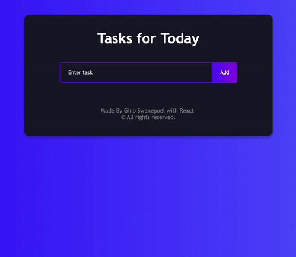

<h1 align="center">📝 To-do List 📝</h1>

<p align="center"> Made in React using Material-UI, constructed with create-react-app, utilizes Hooks & Components. </p>
<p align="center">
  
  <a href="#" target="_blank">
    
  </a>
  <a href="https://twitter.com/mrginolee" target="_blank">
    
  </a>
</p>

<h2 align="center">📋 <a href="https://ginoleeswan.github.io/todo-list-basic/">See Live</a> 📋</h2>

<p align="center">
<a href="https://ginoleeswan.github.io/todo-list-basic/">
    
  </a>
</p>

<h2 align="right">📖 &nbsp; Lessons Learned</h2>

<div align="right">

&nbsp; The mandatory todo list! My first react project.\
&nbsp; This was a nice introduction into the **basics** of react.

&nbsp; I focused on understanding how to use and create **Components** as opposed to conventional OOP programming.
&nbsp; Using react **Hooks** made state management simple and functions much neater and simple to implement.

&nbsp; I styled this project in vanilla **CSS** and adapted visuals for mobile screens

&nbsp; As this was my first project i was unsure on how to deploy it.\
&nbsp; I decided to use **gh-pages** for deployment and it was a fairly simple process.

</div>

## 🔮 &nbsp; Future Features

- ⌛ &nbsp; History of completed tasks
- 🔙 &nbsp; Undo functionality
- ⏲️ &nbsp; Timers & Due Dates
- 🎞️ &nbsp; Smooth Animations

<h2 align="right">🚀 &nbsp; Deployment</h2>
<div align="right">

Deployed with [Github Pages](https://ginoleeswan.github.io/todo-list-basic/)

</div>

## 🔨 &nbsp; Get Started

From your command line, first clone this repo:

```sh
# Clone this repository
$ git clone https://github.com/ginoleeswan/covid-19-tracker/

# Go into the repository
$ cd covid-19-tracker

# Remove current origin repository
$ git remote remove origin
```

### Install

```sh
npm install
```

### Usage

```sh
npm run start
```

### Run tests

```sh
npm run test
```

<div align="right">

## ✍️ &nbsp; Author

👤 **Gino Swanepoel**

&nbsp; Twitter: [@mrginolee](https://twitter.com/mrginolee)\
 &nbsp; Github: [@ginoleeswan](https://github.com/ginoleeswan)\
 &nbsp; LinkedIn: [@ginoswanepoel](https://linkedin.com/in/ginoswanepoel)

<<<<<<< HEAD

# </div>

<a href="https://www.patreon.com/ginolee">
  
</a>

## 📝 License

> > > > > > > 816474e0c340e29510c58a1deca150227ebc8687

## ❤️ &nbsp; Show your support

<<<<<<< HEAD
Give a ⭐️ if this project helped you!
=======

---

> > > > > > > 816474e0c340e29510c58a1deca150227ebc8687
